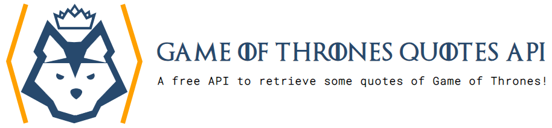

# Game of Thrones quotes API

A simple API to retrieve some quotes of the famous TV Show, Game of Thrones!

:globe_with_meridians: Website and demo: https://gameofthronesquotes.xyz/

## Production host

🆕 [https://api.gameofthronesquotes.xyz](https://api.gameofthronesquotes.xyz)

OLD : [https://game-of-thrones-quotes.herokuapp.com](https://game-of-thrones-quotes.herokuapp.com)

## API

### `GET /v1/random`

Get a random quote:

> [https://api.gameofthronesquotes.xyz/v1/random](https://api.gameofthronesquotes.xyz/v1/random)

    {
        "sentence": "If I fall, don't bring me back.",
        "character": {
            "name": "Jon Snow",
            "slug": "jon",
            "house": {
                "name": "House Stark of Winterfell";
                "slug": "stark"
            }
        }
    }

### `GET /v1/random/{number}`

Returns `{number}` quotes.  
`number` parameter is optional. By default, one quote is returned.

> [https://api.gameofthronesquotes.xyz/v1/random/3](https://api.gameofthronesquotes.xyz/v1/random/3)

    [
      {
        "sentence": "If I fall, don't bring me back.",
        "character": {
            "name": "Jon Snow",
            "slug": "jon",
            "house": {
                "name": "House Stark of Winterfell",
                "slug": "stark"
            }
        }
      },
      {
        "sentence": "The man who passes the sentence should swing the sword.",
        "character": {
            "name": "Ned Stark",
            "slug": "ned",
            "house": {
                "name": "House Stark of Winterfell",
                "slug": "stark"
            }
        }
      },
      {
        "sentence": "I am your son. I have always been your son.",
        "character": {
            "name": "Tyrion Lannister",
            "slug": "tyrion",
            "house": {
                "name": "House Lannister of Casterly Rock",
                "slug": "lannister"
            }
        }
      }
    ]

### `GET /v1/author/{character}/{number}`

Returns quotes for a character *(how to find this information explained below)*.  
`number` parameter is optional. By default, all quotes from the character are returned.

> [https://api.gameofthronesquotes.xyz/v1/author/tyrion/2](https://api.gameofthronesquotes.xyz/v1/author/tyrion/2)

    [
        {
            "sentence": "It's not easy being drunk all the time. Everyone would do it, if it were easy.",
            "character": {
                "name": "Tyrion Lannister",
                "slug": "tyrion",
                "house": {
                    "name": "House Lannister of Casterly Rock",
                    "slug": "lannister"
                }
            }
        },
        {
            "sentence": "No matter who you are, no matter how strong you are, sooner or later, you’ll face circumstances beyond your control.",
            "character": {
                "name": "Tyrion Lannister",
                "slug": "tyrion",
                "house": {
                    "name": "House Lannister of Casterly Rock",
                    "slug": "lannister"
                }
            }
        }
    ]

### `GET /v1/houses`

Returns the list of houses with their members.

> [https://api.gameofthronesquotes.xyz/v1/houses](https://api.gameofthronesquotes.xyz/v1/houses)

    [
        {
            "slug": "stark",
            "name": "House Stark of Winterfell",
            "members": [
                {"name": "Jon Snow", "slug": "jon"},
                {"name": "Sansa Stark", "slug": "sansa"},
                {"name": "Ned Stark", "slug": "ned"},
                {"name": "Arya Stark", "slug": "arya"},
                {"name": "Bran Stark", "slug": "bran"}
            ]
        },
        {
            "slug": "lannister",
            "name": "House Lannister of Casterly Rock",
            "members": [
                {"name": "Jaime Lannister", "slug": "jaime"},
                {"name": "Tyrion Lannister", "slug": "tyrion"},
                {"name": "Cersei Lannister", "slug": "cersei"},
                {"name": "Tywin Lannister", "slug": "tywin"}
            ]
        }
    ]

### `GET /v1/house/{name}`

Returns the house's details.  
`name` parameter is the house's diminutive *(how to find this information explained below)*.

> [https://api.gameofthronesquotes.xyz/v1/house/stark](https://api.gameofthronesquotes.xyz/v1/house/stark)

    [
        {
            "slug": "stark",
            "name": "House Stark of Winterfell",
            "members": [
                {"name": "Jon Snow", "slug": "jon"},
                {"name": "Sansa Stark", "slug": "sansa"},
                {"name": "Ned Stark", "slug": "ned"},
                {"name": "Arya Stark", "slug": "arya"},
                {"name": "Bran Stark", "slug": "bran"}
            ]
        }
    ]

### `GET /v1/characters`

Returns the list of characters with their quotes.

> [https://api.gameofthronesquotes.xyz/v1/characters](https://api.gameofthronesquotes.xyz/v1/characters)

    [
        {
            "name": "Jon Snow",
            "slug": "jon",
            "house": {
                "slug": "stark",
                "name": "House Stark of Winterfell"
            },
            "quotes": [
                "If I fall, don't bring me back.",
                "There is only one war that matters. The Great War. And it is here.",
                "Love is the death of duty.",
                "The war is not over. And I promise you, friend, the true enemy won’t wait out the storm. He brings the storm."
            ]
        },
        {
            "name": "Ned Stark",
            "slug": "ned",
            "house": {
                "slug": "stark",
                "name": "House Stark of Winterfell"
            },
            "quotes": [
                "The man who passes the sentence should swing the sword.",
                "I grew up with soldiers. I learned how to die a long time ago."
            ]
        }
    ]

### `GET /v1/character/{name}`

Returns the character's details.  
`name` parameter is the character's diminutive *(how to find this information explained below)*.

> [https://api.gameofthronesquotes.xyz/v1/character/jon](https://api.gameofthronesquotes.xyz/v1/character/jon)

    [
        {
            "name": "Jon Snow",
            "house": {
                "slug": "stark",
                "name": "House Stark of Winterfell"
            },
            "quotes": [
                "If I fall, don't bring me back.",
                "There is only one war that matters. The Great War. And it is here.",
                "Love is the death of duty.",
                "The war is not over. And I promise you, friend, the true enemy won’t wait out the storm. He brings the storm."
            ]
        }
    ]

### How to find the diminutives of the houses and characters?

The diminutives of houses and characters are present in the "slug" entry in the results.  
You can also find them in the `datas.yaml` file.

For houses:

    houses:
        stark:
            name: House Stark of Winterfell
        lannister:
            name: House Lannister of Casterly Rock
        baratheon:
            name: House Baratheon of Dragonstone

The diminutives are: stark, lannister, baratheon, etc...

For characters:

    characters:
        jon:
            name: Jon Snow
            house: stark
        sansa:
            name: Sansa Stark
            house: stark
        ned:
            name: Ned Stark
            house: stark

The diminutives are: jon, sansa, ned, etc...

## Docker

You can find the Dockerfile [here](https://github.com/shevabam/dockerfiles/tree/master/game-of-thrones-quotes-api) and on [Docker Hub](https://hub.docker.com/r/shevabam/game-of-thrones-quotes-api/).

## Contributing

If you want to add some quotes, please follow these steps. Make sure you have Git installed on your local computer.

* Fork the projet by clicking on the "Fork" button on the top right corner of this page
* Git clone your fork
* Open the file `datas.yaml`
* Make sure the quote doesn't already exist!
* Edit the sections. Make sure the character and house exist.
* Commit and push your changes
* Submit a pull request

Thanks!